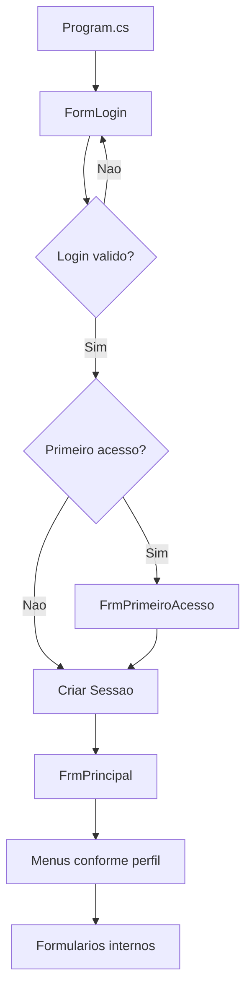

# 01 - Visao Geral CSharp

## Objetivo

O modulo C# do Flow Academy fornece uma interface desktop para gestao academica e administrativa, usando Windows Forms e o banco MySQL compartilhado com o modulo PHP.

## Tipo de aplicacao

- Aplicacao desktop Windows.
- Interface baseada em formularios.
- Navegacao por dashboard principal.
- Controle de permissoes conforme perfil logado.

## Tecnologias

- C#.
- .NET 8.
- Windows Forms.
- MySql.Data.
- MySQL/MariaDB.

## Solucao

Arquivo principal:

```text
FlowAcademy_cs/FlowAcademy.sln
```

Projetos:

| Projeto | Tipo | Responsabilidade |
| --- | --- | --- |
| `FlowAcademy` | Windows Forms | Telas, login, dashboard e interacao com usuario |
| `FlowAcademyClasses` | Class Library | Entidades, conexao, autenticacao e acesso ao banco |

## Funcionalidades principais

- Login com e-mail e senha.
- Primeiro acesso com troca de senha.
- Dashboard desktop por perfil.
- Controle de permissoes por menu.
- Cadastro de usuarios.
- Cadastro de alunos.
- Cadastro de professores.
- Cadastro de funcionarios.
- Cadastro de cursos.
- Cadastro de disciplinas/unidades curriculares.
- Cadastro de turmas.
- Cadastro de matriculas.
- Lancamento de notas.
- Registro de frequencia.
- Consulta de boletim do aluno.
- Consulta de frequencia do aluno.
- Controle de pagamentos.

## Perfis atendidos

- Aluno.
- Professor.
- Coordenacao.
- Administrativo.
- Admin.

## Fluxo geral



