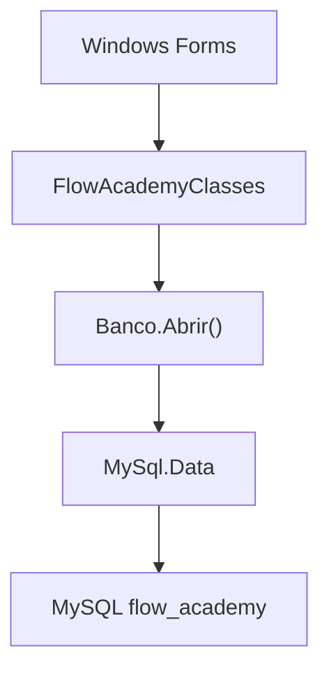

# 03 - Arquitetura Desktop

## Visao geral

O modulo C# usa uma arquitetura simples em dois projetos:

```text
FlowAcademy
FlowAcademyClasses
```

O projeto `FlowAcademy` contem as telas Windows Forms. O projeto `FlowAcademyClasses` contem classes de dominio, conexao e servicos.

## Camadas



## Projeto FlowAcademy

Responsavel por:

- Login.
- Dashboard principal.
- Layout desktop.
- Formularios de CRUD.
- Validacoes de tela.
- Mensagens ao usuario.
- Controle visual de permissoes.

Principais arquivos:

- `Program.cs`
- `FormLogin.cs`
- `FrmPrincipal.cs`
- `FrmAluno.cs`
- `FrmProfessor.cs`
- `FrmCurso.cs`
- `FrmDisciplina.cs`
- `FrmTurma.cs`
- `FrmMatricula.cs`
- `FrmNota.cs`
- `FrmFrequencia.cs`
- `FrmPagamento.cs`

## Projeto FlowAcademyClasses

Responsavel por:

- Conexao com banco.
- Autenticacao.
- Sessao.
- Entidades.
- Insercao, atualizacao, exclusao e consulta.

Principais arquivos:

- `Banco.cs`
- `AuthService.cs`
- `Sessao.cs`
- `Usuario.cs`
- `Aluno.cs`
- `Professor.cs`
- `Curso.cs`
- `Disciplina.cs`
- `Turma.cs`
- `Matricula.cs`
- `Nota.cs`
- `Frequencia.cs`
- `Pagamento.cs`
- `AlertaRisco.cs`

## Fluxo de login

1. `Program.cs` inicia `FormLogin`.
2. Usuario informa e-mail e senha.
3. `FormLogin` chama `AuthService.Login`.
4. `AuthService` delega para `Usuario.EfetuarLogin`.
5. A senha e validada com SHA256.
6. Se `ultimo_login` estiver nulo, abre `FrmPrimeiroAcesso`.
7. Dados do usuario sao salvos em `Sessao`.
8. Abre `FrmPrincipal`.

## Fluxo de permissao

O controle visual de permissoes ocorre em `FrmPrincipal`.

Cada perfil libera menus diferentes:

- Aluno: boletim e frequencia.
- Professor: notas e frequencia.
- Coordenacao: alunos, cursos, disciplinas, turmas e matriculas.
- Administrativo: alunos, matriculas e pagamentos.
- Admin: cadastros principais, notas, frequencia e pagamentos.

## Acesso ao banco

Classe:

```text
FlowAcademyClasses/Banco.cs
```

Metodo:

```csharp
Banco.Abrir()
```

Esse metodo cria um `MySqlConnection`, abre a conexao e retorna um `MySqlCommand` pronto para uso.

