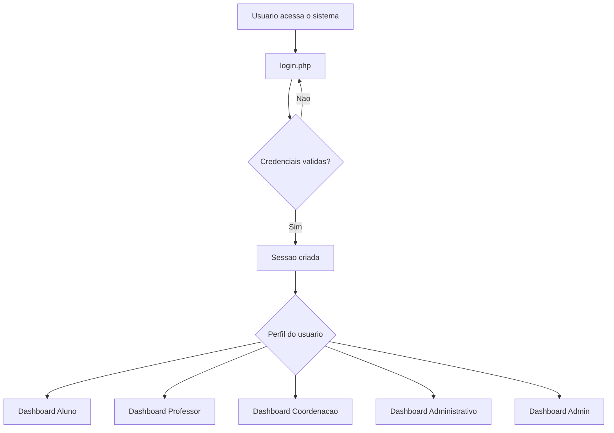

# 01 - Visao Geral

## Nome do projeto

Flow Academy PHP.

## Objetivo

O objetivo do sistema e apoiar a gestao academica de uma escola tecnica presencial, permitindo que diferentes perfis acessem suas rotinas de acordo com suas responsabilidades.

## Publico-alvo

- Alunos.
- Professores.
- Coordenacao.
- Administrativo.
- Administradores do sistema.

## Principais funcionalidades

- Login por usuario e perfil.
- Redirecionamento automatico para o painel do perfil logado.
- Controle de permissao por pagina.
- Dashboard por perfil.
- Cadastro e consulta de alunos.
- Cadastro e consulta de professores.
- Cadastro e edicao de cursos.
- Cadastro e edicao de unidades curriculares.
- Cadastro e edicao de turmas.
- Matricula de aluno em turma.
- Lancamento de notas.
- Registro de frequencia.
- Consulta de boletim.
- Consulta de frequencia pelo aluno.
- Controle de pagamentos.
- Registro de logs.
- Monitoramento de alertas academicos.

## Tecnologias utilizadas

- PHP.
- MySQL ou MariaDB.
- PDO.
- HTML.
- Bootstrap local como base de CSS e JavaScript.
- CSS proprio apenas como complemento visual.
- JavaScript proprio apenas como complemento de comportamento.

## Caracteristicas do projeto

- Nao usa framework PHP.
- Mantem arquitetura simples para compatibilidade com curso tecnico.
- Usa arquivos PHP organizados por responsabilidade.
- Usa sessao PHP para manter o usuario logado.
- Usa SHA256 para compatibilidade com a versao desktop/C# do projeto.
- Usa consultas preparadas via PDO.

## Fluxo resumido

