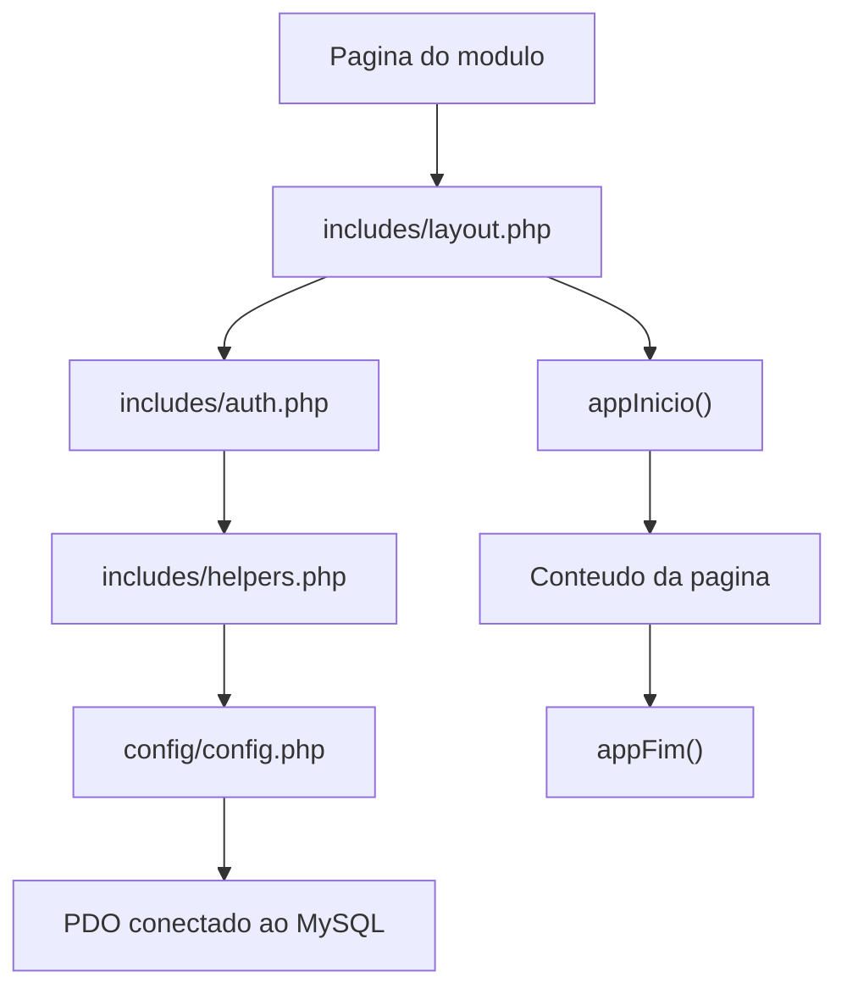

# 03 - Arquitetura do Projeto

## Estrutura de pastas

```text
FlowAcademy_php/
+-- banco/
|   +-- Banco_oficial.sql
+-- docs/
+-- scripts/
|   +-- instalar_dados_teste.php
+-- web-php/
    +-- assets/
    |   +-- bootstrap/
    |   +-- css/
    |   +-- img/
    |   +-- js/
    +-- classes/
    |   +-- database/
    |   +-- models/
    |   +-- services/
    +-- config/
    +-- includes/
    +-- pages/
    +-- index.php
    +-- login.php
    +-- alterar_senha.php
    +-- logout.php
```

## Responsabilidade das pastas

### `banco/`

Guarda o script oficial do banco de dados.

### `docs/`

Guarda a documentacao do projeto.

### `scripts/`

Guarda arquivos auxiliares que nao fazem parte da navegacao principal, como carga de dados de teste.

### `web-php/`

Guarda a aplicacao PHP acessada pelo navegador.

### `web-php/assets/`

Guarda arquivos estaticos:

- Bootstrap 5.0.2 local como base obrigatoria de CSS e JS.
- CSS proprio.
- JavaScript proprio.
- Imagens e logos.

### `web-php/classes/database/`

Guarda a classe de conexao ou carregamento da conexao.

### `web-php/classes/models/`

Guarda classes que representam entidades do sistema:

- Usuario.
- Aluno.
- Professor.
- Curso.
- Disciplina.
- Turma.
- Matricula.
- Nota.
- Frequencia.
- Pagamento.
- Log.
- AlertaRisco.

### `web-php/classes/services/`

Guarda classes de servico para regras ou fluxos especificos:

- AuthService.
- NotaService.
- FrequenciaService.
- MatriculaService.

### `web-php/includes/`

Guarda arquivos compartilhados:

- `auth.php`: login, sessao e permissoes.
- `helpers.php`: funcoes auxiliares gerais.
- `formatacao.php`: formatacao de datas, moeda, status e textos.
- `validacoes.php`: validacoes simples.
- `layout.php`: layout principal das paginas internas.
- `header.php`, `footer.php`, `navbar.php`, `sidebar.php`: arquivos padronizados de apoio.

### `web-php/pages/`

Guarda paginas separadas por modulo:

- `admin`
- `administrativo`
- `aluno`
- `coordenacao`
- `financeiro`
- `professor`
- `shared`

## Fluxo de carregamento de uma pagina interna



## Padrao visual

As paginas internas usam:

- Sidebar.
- Topbar.
- Area de conteudo principal.
- Cards, tabelas, badges e alertas.
- Bootstrap 5.0.2 local carregado primeiro.
- Tema visual proprio em `assets/css/main.css`, usado apenas como complemento.
- Comportamentos proprios em `assets/js/app.js`, carregados depois do `bootstrap.bundle.min.js`.
