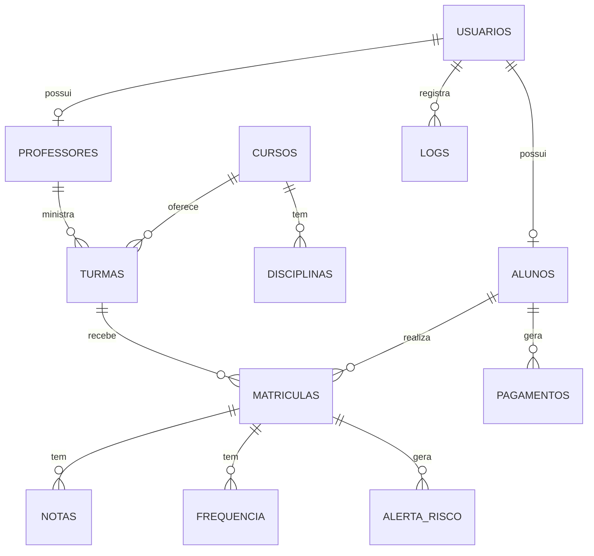

# 05 - Banco de Dados

## Arquivo oficial

```text
FlowAcademy_php/banco/Banco_oficial.sql
```

## Banco

```sql
CREATE DATABASE IF NOT EXISTS flow_academy;
```

## Principais tabelas

### `usuarios`

Guarda usuarios de login.

Campos principais:

- `id_usuario`
- `nome`
- `email`
- `senha_hash`
- `perfil`
- `status`
- `ultimo_login`
- `created_at`

Perfis aceitos:

- `aluno`
- `professor`
- `coordenacao`
- `administrativo`
- `admin`

### `alunos`

Guarda dados academicos do aluno e vincula com `usuarios`.

Campos principais:

- `id_aluno`
- `id_usuario`
- `matricula`
- `cpf`
- `telefone`
- `data_nascimento`
- `endereco`
- `status_academico`

### `professores`

Guarda dados dos professores e vincula com `usuarios`.

Campos principais:

- `id_professor`
- `id_usuario`
- `cpf`
- `especialidade`

### `cursos`

Guarda cursos oferecidos.

Campos principais:

- `id_curso`
- `nome`
- `descricao`
- `carga_horaria`
- `status`

### `disciplinas`

Representa unidades curriculares dos cursos.

Campos principais:

- `id_disciplina`
- `id_curso`
- `nome`
- `carga_horaria`

### `turmas`

Guarda turmas vinculadas a curso e professor.

Campos principais:

- `id_turma`
- `id_curso`
- `id_professor`
- `codigo_turma`
- `turno`
- `periodo_letivo`
- `capacidade_maxima`
- `status`

### `matriculas`

Guarda vinculo entre aluno e turma.

Campos principais:

- `id_matricula`
- `id_aluno`
- `id_turma`
- `data_matricula`
- `status`

### `notas`

Guarda notas por matricula e unidade curricular.

Campos principais:

- `id_nota`
- `id_matricula`
- `id_disciplina`
- `prova_1`
- `prova_2`
- `trabalho`
- `comportamental`
- `media_uc`
- `status`
- `data_lancamento`

### `frequencia`

Guarda frequencia por matricula e unidade curricular.

Campos principais:

- `id_frequencia`
- `id_matricula`
- `id_disciplina`
- `total_aulas`
- `presencas`
- `percentual`

### `pagamentos`

Guarda cobrancas e pagamentos de alunos.

Campos principais:

- `id_pagamento`
- `id_aluno`
- `valor`
- `vencimento`
- `status`

### `logs`

Guarda acoes relevantes realizadas por usuarios.

Campos principais:

- `id_log`
- `id_usuario`
- `acao`
- `ip`
- `data_evento`

### `alerta_risco`

Guarda alertas academicos de nota, frequencia ou ambos.

Campos principais:

- `id_alerta`
- `id_matricula`
- `tipo_risco`
- `score`
- `status`

## Relacionamentos principais



## Procedures e functions

O arquivo oficial possui procedures e functions armazenadas. A aplicacao PHP, porem, executa suas principais operacoes com SQL direto via PDO nas paginas e classes.

Isso significa que:

- O banco guarda procedures para compatibilidade e apoio.
- O PHP nao depende obrigatoriamente delas para executar as telas principais.

