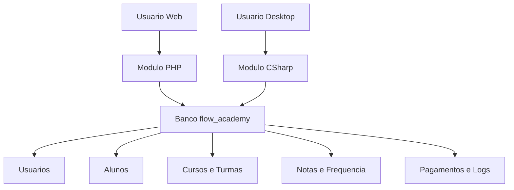

# 01 - Visao Geral do Projeto

## Nome

Flow Academy.

## Objetivo geral

O Flow Academy e um sistema integrado de gestao academica desenvolvido para uma escola tecnica presencial. O projeto possui dois modulos de aplicacao e um banco de dados compartilhado.

## Modulos

### Modulo Web PHP

Local:

```text
FlowAcademy_php/
```

Objetivo:

- Fornecer acesso web por perfil.
- Atender alunos, professores, coordenacao, administrativo e admin.
- Permitir uso via navegador.

### Modulo Desktop CSharp

Local:

```text
FlowAcademy_cs/
```

Objetivo:

- Fornecer aplicacao desktop Windows Forms.
- Apoiar rotinas administrativas e academicas.
- Usar classes C# e procedures no banco.

### Banco de Dados

Local:

```text
FlowAcademy_php/banco/Banco_oficial.sql
```

Objetivo:

- Centralizar dados dos dois modulos.
- Manter usuarios, alunos, professores, cursos, turmas, matriculas, notas, frequencia, pagamentos, logs e alertas.

## Publico-alvo

- Escola tecnica.
- Secretaria academica.
- Coordenacao.
- Professores.
- Alunos.
- Administradores do sistema.

## Principais beneficios

- Centralizacao de dados academicos.
- Controle por perfil.
- Acesso web e desktop.
- Regras de negocio academicas documentadas.
- Banco unico para os modulos.
- Projeto adequado ao contexto de curso tecnico.

## Visao integrada



