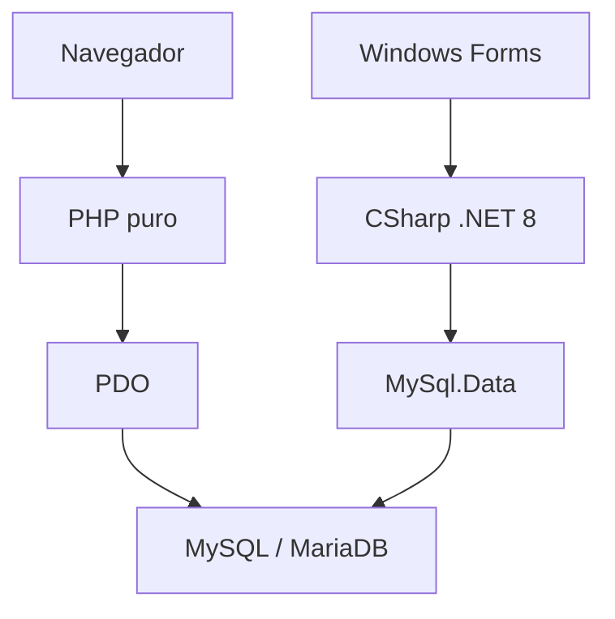

# 02 - Arquitetura Integrada

## Visao geral

O projeto possui duas interfaces conectadas ao mesmo banco.

```text
PHP Web <--> MySQL flow_academy <--> CSharp Desktop
```

## Camadas



## Modulo PHP

Caracteristicas:

- Executa no servidor web.
- Usa PHP puro.
- Usa PDO.
- Organiza paginas por perfil.
- Usa includes compartilhados.
- Usa Bootstrap local como base de CSS e JavaScript.

Documentacao especifica:

```text
FlowAcademy_php/docs/README.md
```

## Modulo CSharp

Caracteristicas:

- Executa como aplicacao desktop Windows.
- Usa .NET 8 Windows Forms.
- Usa MySql.Data.
- Organiza telas em formularios.
- Usa biblioteca de classes para entidades.
- Usa procedures em operacoes de CRUD.

Documentacao especifica:

```text
FlowAcademy_cs/docs/README.md
```

## Banco compartilhado

Nome:

```text
flow_academy
```

Script oficial:

```text
FlowAcademy_php/banco/Banco_oficial.sql
```

Script auxiliar C#:

```text
procedures_para_Atual_conforme_CSharp.sql
```

## Compatibilidade entre modulos

Os dois modulos compartilham:

- Tabela `usuarios`.
- Perfis de acesso.
- Hash SHA256 para senha.
- Tabelas academicas.
- Regras de notas.
- Regras de frequencia.
- Estrutura de matricula.

## Diferencas entre modulos

| Item | PHP | CSharp |
| --- | --- | --- |
| Tipo | Web | Desktop |
| Interface | HTML/CSS/JS | Windows Forms |
| Acesso ao banco | PDO | MySql.Data |
| CRUD | SQL direto e helpers | Classes e procedures |
| Navegacao | Links e rotas PHP | Menu lateral no FrmPrincipal |
| Sessao | `$_SESSION` | Classe `Sessao` |

## Ponto critico de integracao

O banco deve permanecer coerente para os dois modulos. Alteracoes em tabelas, colunas, perfis ou procedures precisam ser testadas tanto no PHP quanto no C#.
