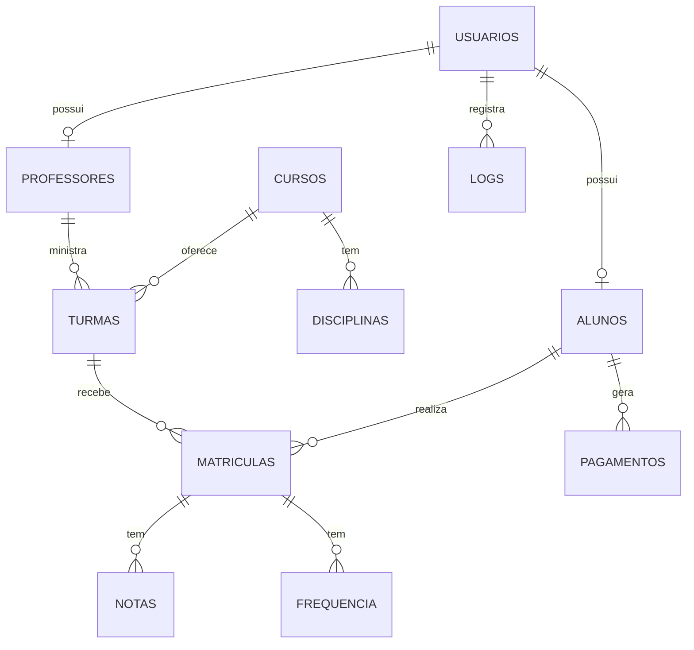

# 04 - Relatorio do Banco de Dados

## Banco

```text
flow_academy
```

## Arquivo oficial

```text
FlowAcademy_php/banco/Banco_oficial.sql
```

## Script auxiliar

```text
procedures_para_Atual_conforme_CSharp.sql
```

## Tabelas

- `usuarios`
- `alunos`
- `professores`
- `cursos`
- `disciplinas`
- `turmas`
- `matriculas`
- `notas`
- `frequencia`
- `pagamentos`
- `logs`
- `alerta_risco`

## Relacionamentos principais



## Uso pelo PHP

O PHP usa:

- PDO.
- Consultas preparadas.
- Helpers `buscarUm`, `buscarTodos` e `executar`.
- SQL direto nas paginas e classes.

## Uso pelo CSharp

O C# usa:

- MySql.Data.
- `Banco.Abrir()`.
- Classes de entidade.
- Stored procedures em operacoes de inserir, atualizar e excluir.
- Consultas SQL em listagens e filtros.

## Procedures

O banco oficial possui procedures e functions. O script auxiliar `procedures_para_Atual_conforme_CSharp.sql` recria procedures usadas diretamente pelo modulo desktop.

## Recomendacoes

- Manter backup antes de alterar o banco.
- Testar PHP e C# apos mudar tabela ou procedure.
- Evitar renomear colunas usadas pelos dois modulos.
- Manter os perfis sincronizados.
- Atualizar documentacao quando o banco mudar.

